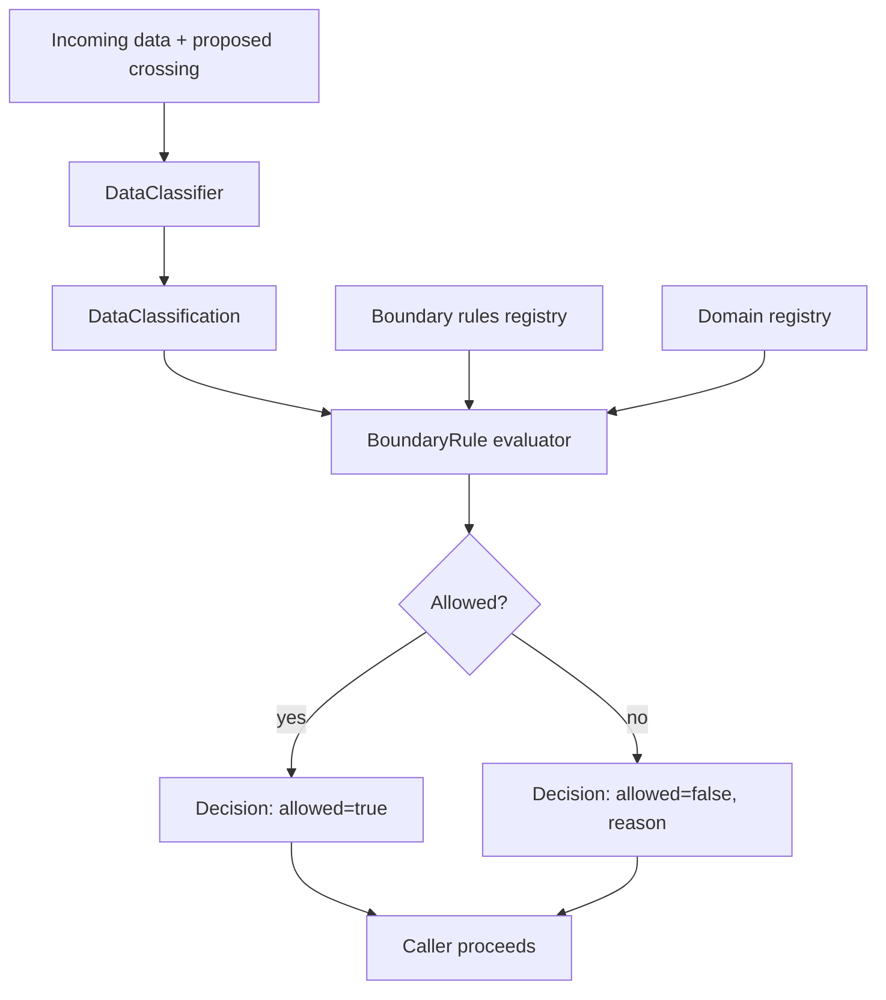

# context-firewall

[](https://github.com/aumos-ai/context-firewall)

**Domain isolation for AI agents** — prevent data leaking between work, personal, health, and financial contexts.

Part of the [Aumos OSS](https://github.com/muveraai/aumos-oss) suite (Phase 4, Project 4.2).

License: [Business Source License 1.1](./LICENSE)

---

## Why Does This Exist?

An AI agent that helps you manage your calendar, answer work emails, book medical appointments, and track personal finances is genuinely useful. It is also, without careful design, a data exfiltration risk at every context boundary.

Think of it like an email spam filter — not the kind that looks for Nigerian princes, but the kind that a hospital uses to ensure that patient records never leave the building over uncontrolled channels. The hospital does not trust that individual staff will always remember the rules. It enforces a policy at the network layer, before the data can cross the boundary.

AI agents face the same problem at the context layer. A health query ("what was my last blood pressure reading?") produces data that is appropriate inside a health conversation and completely inappropriate inside a work response sent to a colleague. Without enforcement at the data layer, that boundary relies entirely on the agent's own judgment — which is not good enough for regulated data categories.

**Without context-firewall**, an agent handling multiple life domains can inadvertently surface health data in a work context, include financial details in a personal chat log, or merge contexts in ways that violate GDPR, HIPAA, or simply the user's reasonable expectations. The failure mode is not usually dramatic — it is a subtle bleed that erodes trust and creates liability over time.

context-firewall enforces hard isolation boundaries at the data layer, before any crossing occurs. It classifies incoming data to its most likely domain using deterministic keyword matching, then evaluates each proposed cross-domain data transfer against a configurable set of boundary rules. Blocked transfers are logged with a reason; allowed transfers proceed.

> Like an email spam filter, but for AI context — blocks data from crossing domain boundaries before it reaches the wrong context.

**What it explicitly does NOT do:** context-firewall does not use ML or LLMs for classification — all classification is keyword-based and deterministic. It does not auto-discover domains. It does not infer cross-domain relationships. Domains and boundary rules are declared by the operator.

---

## Who Is This For?

| Audience | Use Case |
|---|---|
| **Developer** | Add domain isolation to any multi-context AI agent pipeline with a single API call |
| **Enterprise** | Enforce data governance policies between agent contexts to satisfy GDPR, HIPAA, and internal data handling requirements |
| **Both** | Prevent context bleed in agents that operate across work, personal, health, and financial domains |

---

## TypeScript Quick Start

### Prerequisites

- Node.js 18+

### Install

```bash
npm install @aumos/context-firewall
```

### Minimal Working Example

```typescript
import { ContextFirewall } from "@aumos/context-firewall";

const firewall = new ContextFirewall();

const decision = firewall.check(
  { text: "My blood pressure reading is 120/80" },
  "health",
  "work"
);

console.log(decision.allowed);  // false
console.log(decision.reason);   // "Boundary rule 'health->work' blocks this crossing"
```

**What Just Happened?**

`firewall.check()` classified the input data (detected health-domain keywords), looked up the boundary rule for `health -> work`, and found it blocked. It returned a structured `Decision` object with `allowed: false` and a human-readable reason. No external calls, no async, no side effects. Your agent receives the decision and can choose to suppress the data, surface a redacted version, or notify the user.

---

## Python Quick Start

### Prerequisites

- Python 3.10+

### Install

```bash
pip install context-firewall
```

### Minimal Working Example

```python
from context_firewall import ContextFirewall

firewall = ContextFirewall()

decision = firewall.check(
    data={"text": "My blood pressure reading is 120/80"},
    from_domain="health",
    to_domain="work",
)

print(decision.allowed)   # False
print(decision.reason)    # "Boundary rule 'health->work' blocks this crossing"
```

---

## Architecture Overview



context-firewall sits at every point where data crosses a domain boundary in your agent pipeline. It does not sit in the LLM call path — evaluation is synchronous and deterministic, designed for low-overhead inline use.

---

## Domains (Built-In)

| Domain      | Sensitivity | Description                                   |
|-------------|-------------|-----------------------------------------------|
| `work`      | medium      | Professional communications, tasks, projects  |
| `personal`  | high        | Personal relationships, home, lifestyle       |
| `health`    | critical    | Medical, mental health, prescriptions         |
| `financial` | critical    | Banking, taxes, investments, credit           |

Custom domains can be registered with `addDomain()`. See [docs/domains.md](./docs/domains.md).

---

## Core API

### `ContextFirewall`

| Method                    | Description                                              |
|---------------------------|----------------------------------------------------------|
| `check(data, from, to)`   | Evaluate whether data may cross from one domain to another |
| `classify(data)`          | Return the most likely domain for a piece of data        |
| `addDomain(domain)`       | Register a custom domain                                 |
| `addBoundary(rule)`       | Register a custom boundary rule                          |

### `BoundaryRule`

```typescript
interface BoundaryRule {
  name: string;
  fromDomain: string;
  toDomain: string;
  direction: "one-way" | "bidirectional";
  allowedDataTypes: string[];
  blockedDataTypes: string[];
  evaluate(classification: DataClassification): boolean;
}
```

---

## Related Projects

| Project | Relationship |
|---|---|
| [aumos-core](https://github.com/aumos-ai/aumos-core) | Provides the trust and governance primitives that domain policy decisions build on |
| [anomaly-sentinel](https://github.com/aumos-ai/anomaly-sentinel) | Detects suspicious cross-domain access patterns in audit trails |
| [compliance-mapper](https://github.com/aumos-ai/compliance-mapper) | Maps domain isolation configuration to GDPR data minimization controls |
| [mcp-server-trust-gate](https://github.com/aumos-ai/mcp-server-trust-gate) | The MCP enforcement layer — context-firewall protects the context that passes through it |

---

## Documentation

- [Domains](./docs/domains.md)
- [Boundary Rules](./docs/boundary-rules.md)
- [Classification](./docs/classification.md)

---

## Project Structure

```
context-firewall/
├── typescript/          TypeScript package (@aumos/context-firewall)
├── python/              Python package (context-firewall)
├── examples/            Usage examples
├── docs/                Detailed documentation
├── scripts/             Audit and maintenance scripts
├── FIRE_LINE.md         Hard constraints
└── CLAUDE.md            AI session context
```

---

## Contributing

See [CONTRIBUTING.md](./CONTRIBUTING.md).

---

Copyright (c) 2026 MuVeraAI Corporation. Business Source License 1.1.
